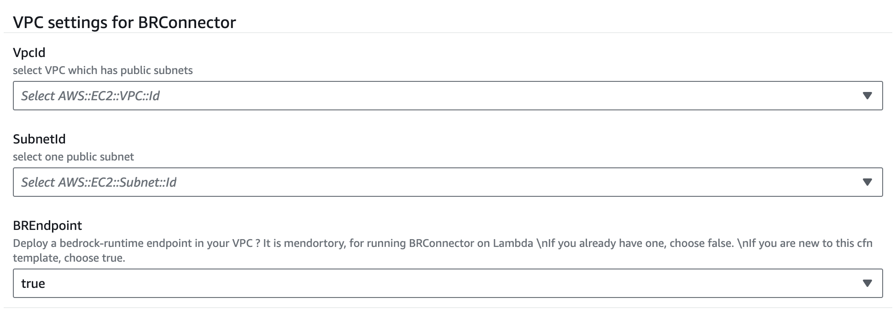
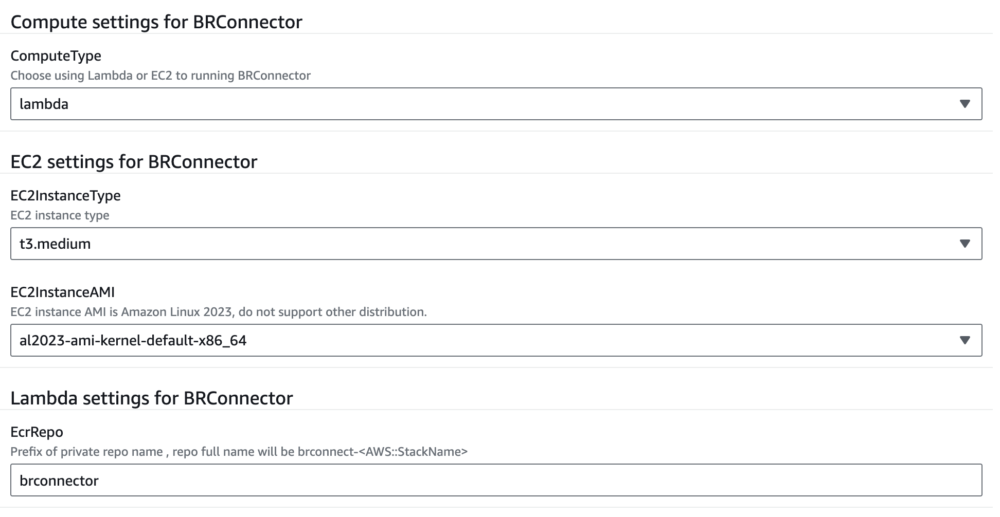
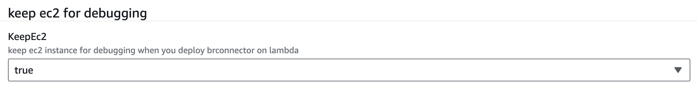

# Quick Deploy BRConnector using Cloudformation

## Supported Region
- Cloudformation template are verified in following regions:
    - us-east-1
    - us-west-2

## Prerequisites
- Enable Claude 3 Sonnet or Haiku in your region - If you are new to using Anthropic models, go to the [Amazon Bedrock console](https://console.aws.amazon.com/bedrock/) and choose **Model access** on the bottom left pane. Request access separately for Claude 3 Sonnet or Haiku.

## Components
Following main components will be included in this Cloudformation template: 
- Cloudfront
- BRConnector on Lambda or EC2
- RDS PostgreSQL or PostgreSQL container on EC2

## Deploy Guide
- Download [quick-build-brconnector.yaml](quick-build-brconnector.yaml) and upload to Cloudformation console.
- VPC parameters
    - Choose a existing VPC with public subnets
    - Choose one public subnet
    - Choose `true` to create Bedrock Endpoint in your subnet. It is mendortory for running BRConnector on Lambda. If you already have one, choose `false` to skip creating.

- Compute parameters
    - Choose ComputeType for BRConnector, Lambda or EC2
    - For EC2 settings
        - Now only support Amazon Linux 2023
        - You could choose to create PostgreSQL as container in same EC2 (`StandaloneDB` to false), or create standalone RDS PostgreSQL as backend (`StandaloneDB` to true)
    - For Lambda settings
        - Define your private repository name prefix string
        - Always create RDS PostgreSQL

- PostgreSQL parameters
    - Default PostgreSQL password is `mysecretpassword`
    - If you choose `StandaloneDB` to false, PostgreSQL will running on EC2 as container. RDS PostgreSQL will be create if this option is true.
    - Keep others as default

- Debugging parameters
    - If you choose Lambda as ComputeType, you could choose to delete EC2 after all resources deploy successfully. This EC2 is used for compiling and building BRConnector container temporarily. 
    - Don't delete EC2 if you choose EC2 as ComputeType

- Until deploy successfully, go to output page and copy cloudfront URL and first user key to your bedrock client settings page.

- Also you could connect to `BRConnector` EC2 instance with SSM Session Manager ([docs](https://docs.aws.amazon.com/systems-manager/latest/userguide/session-manager-working-with-sessions-start.html#start-ec2-console))

