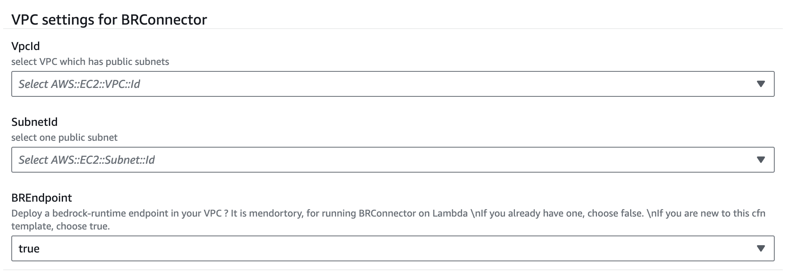
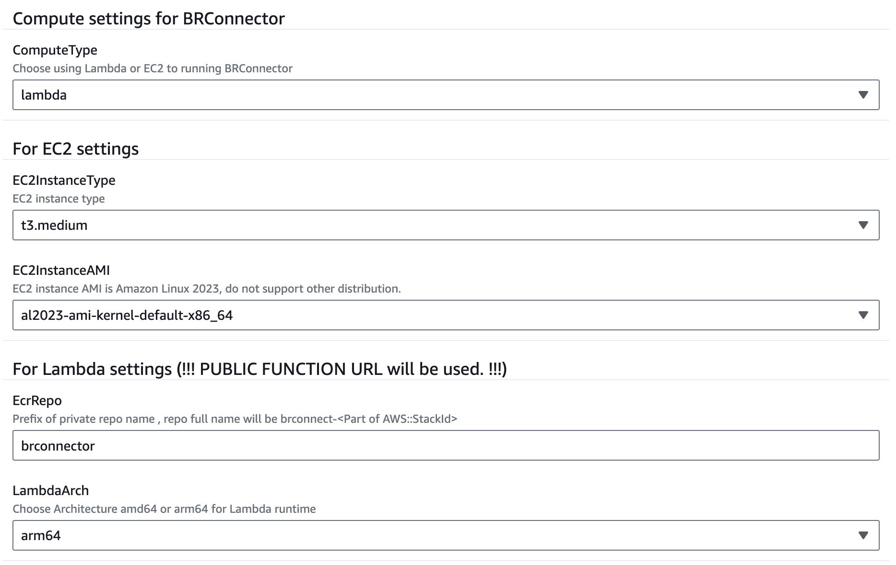
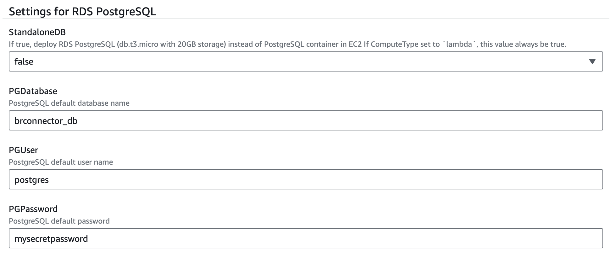
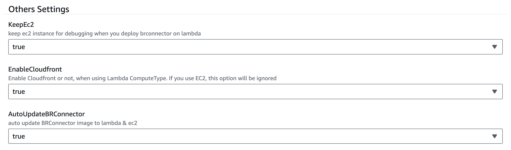

# Quick Deploy BRConnector using Cloudformation

## Supported Region
- Cloudformation template are verified in following regions:
    - us-east-1
    - us-west-2

## Prerequisites
- Enable Claude 3 Sonnet or Haiku in your region - If you are new to using Anthropic models, go to the [Amazon Bedrock console](https://console.aws.amazon.com/bedrock/) and choose **Model access** on the bottom left pane. Request access separately for Claude 3 Sonnet or Haiku.

## Components
Following key components will be included in this Cloudformation template: 
- Cloudfront
- BRConnector on Lambda or EC2
- RDS PostgreSQL or PostgreSQL container on EC2
- ECR with pull through cache enabled

## Deploy Guide
- Download [quick-build-brconnector.yaml](quick-build-brconnector.yaml) and upload to Cloudformation console or click this button to launch directly.

[](https://console.aws.amazon.com/cloudformation/home#/stacks/create/template?stackName=brconnector1&templateURL=https://sample-connector-bedrock.s3.us-west-2.amazonaws.com/quick-build-brconnector.yaml)

- VPC parameters
    - Choose a existing VPC with public subnets
    - Choose one public subnet
    - Choose `true` to create Bedrock Endpoint in your subnet. It is mendortory for running BRConnector on Lambda. If you already have one, choose `false` to skip creating.



- Compute parameters
    - Choose ComputeType for BRConnector, Lambda or EC2
    - For EC2 settings
        - Now only support Amazon Linux 2023
        - You could choose to create PostgreSQL as container in same EC2 (`StandaloneDB` to false), or create standalone RDS PostgreSQL as backend (`StandaloneDB` to true)
    - For Lambda settings
        - <mark style="background: #ADCCFFA6;">PUBLIC Function URL</mark> will be used. Please ensure this security setting is acceptable
        - Define your private repository name prefix string
        - Always create RDS PostgreSQL (`StandaloneDB` to true)



- PostgreSQL parameters
    - Default PostgreSQL password is `mysecretpassword`
    - If you choose `StandaloneDB` to false, PostgreSQL will running on EC2 as container. RDS PostgreSQL will be create if this option is true.
    - Keep others as default



- Debugging parameters
    - If you choose Lambda as ComputeType, you could choose to delete EC2 after all resources deploy successfully. This EC2 is used for compiling and building BRConnector container temporarily. 
    - Don't delete EC2 if you choose EC2 as ComputeType
    - If you set `true` to AutoUpdateBRConnector, one script will be add to ec2 crontab



- Until deploy successfully, go to output page and copy Cloudfront URL and first user key to your bedrock client settings page.


- Also you could connect to `BRConnector` EC2 instance with SSM Session Manager ([docs](https://docs.aws.amazon.com/systems-manager/latest/userguide/session-manager-working-with-sessions-start.html#start-ec2-console))

## Update BRConnector
### ECR with pull through cache enabled
- Check your ECR settings, if has rules in pull through cache page, you have enabled this feature to update ECR image with upstream repo automatically.
- this script could running on any compactibility linux with bash shell to update your BRConnector easier
```sh
# this script is for update lambda image 
# running on amazon linux 2023 on amd64
# modify ACCOUNT_ID / AWS_DEFAULT_REGION / Cloudformation STACK_NAME before execution

export ACCOUNT_ID=123456789012
export AWS_DEFAULT_REGION=us-west-2
STACK_NAME=cloudformation_stack_name
DOCKERHUB_REPO=x6u9o2u4/sample-connector-for-bedrock-lambda


yum install -y docker jq git cronie

if [[ ! -x /usr/local/bin/regctl ]]; then
  curl -L https://github.com/regclient/regclient/releases/latest/download/regctl-linux-amd64 >regctl
  chmod 755 regctl
  sudo mv regctl /usr/local/bin
fi

export AWS_PAGER=""
# get ecr repo name
aws cloudformation describe-stacks --stack-name ${STACK_NAME} > /tmp/$$.yaml
STACK_ID=$(cat /tmp/$$.yaml |jq -r '.Stacks[].StackId')
REPO_PREFIX=$(cat /tmp/$$.yaml |jq -r '.Stacks[].Parameters[] | select (.ParameterKey == "EcrRepo") | .ParameterValue')
ECR_REPO=${REPO_PREFIX}-${STACK_ID##*-}/${DOCKERHUB_REPO}
FUNCTION_NAME=$(cat /tmp/$$.yaml |jq -r '.Stacks[].Outputs[] | select (.OutputKey == "MyFunctionName") | .OutputValue')

# pull local
aws ecr get-login-password --region ${AWS_DEFAULT_REGION} | docker login --username AWS --password-stdin ${ACCOUNT_ID}.dkr.ecr.${AWS_DEFAULT_REGION}.amazonaws.com
#docker pull ${ACCOUNT_ID}.dkr.ecr.${AWS_DEFAULT_REGION}.amazonaws.com/${ECR_REPO}:latest

# tag amd64 / arm64
AMD64_DIG=$(regctl image digest --platform linux/amd64 public.ecr.aws/${DOCKERHUB_REPO}:latest)
ARM64_DIG=$(regctl image digest --platform linux/arm64 public.ecr.aws/${DOCKERHUB_REPO}:latest)
regctl image copy ${ACCOUNT_ID}.dkr.ecr.${AWS_DEFAULT_REGION}.amazonaws.com/${ECR_REPO}@${AMD64_DIG} ${ACCOUNT_ID}.dkr.ecr.${AWS_DEFAULT_REGION}.amazonaws.com/${ECR_REPO}:amd64
regctl image copy ${ACCOUNT_ID}.dkr.ecr.${AWS_DEFAULT_REGION}.amazonaws.com/${ECR_REPO}@${ARM64_DIG} ${ACCOUNT_ID}.dkr.ecr.${AWS_DEFAULT_REGION}.amazonaws.com/${ECR_REPO}:arm64

# update lambda function image uri
if [[ ! -z ${FUNCTION_NAME} ]]; then
  IMAGE_URI=$(aws lambda get-function --function-name ${FUNCTION_NAME} --query 'Code.ImageUri' --output text)
  aws lambda update-function-code --function-name ${FUNCTION_NAME} --image-uri ${IMAGE_URI}
else
  echo "cannot get lambda function name"
fi

```

### ECR without pull through cache enabled
- following this script to update image manually if you do not enable ECR pull through cache
```sh
export AWS_DEFAULT_REGION=us-west-2
export ACCOUNT_ID=123456789012
export PrivateECRRepository=your_private_repo_name

aws ecr get-login-password --region ${AWS_DEFAULT_REGION} | docker login --username AWS --password-stdin ${ACCOUNT_ID}.dkr.ecr.${AWS_DEFAULT_REGION}.amazonaws.com

# pull/tag/push arm64 image for lambda
docker pull --platform=linux/arm64 public.ecr.aws/x6u9o2u4/sample-connector-for-bedrock-lambda
docker tag public.ecr.aws/x6u9o2u4/sample-connector-for-bedrock-lambda ${ACCOUNT_ID}.dkr.ecr.${AWS_DEFAULT_REGION}.amazonaws.com/${PrivateECRRepository}:arm64
docker push ${ACCOUNT_ID}.dkr.ecr.${AWS_DEFAULT_REGION}.amazonaws.com/${PrivateECRRepository}:arm64

# pull/tag/push amd64 image for lambda
docker pull --platform=linux/amd64 public.ecr.aws/x6u9o2u4/sample-connector-for-bedrock-lambda
docker tag public.ecr.aws/x6u9o2u4/sample-connector-for-bedrock-lambda ${ACCOUNT_ID}.dkr.ecr.${AWS_DEFAULT_REGION}.amazonaws.com/${PrivateECRRepository}:amd64
docker push ${ACCOUNT_ID}.dkr.ecr.${AWS_DEFAULT_REGION}.amazonaws.com/${PrivateECRRepository}:amd64

# create/push manifest file
docker manifest create ${ACCOUNT_ID}.dkr.ecr.${AWS_DEFAULT_REGION}.amazonaws.com/${PrivateECRRepository}:latest --amend ${ACCOUNT_ID}.dkr.ecr.${AWS_DEFAULT_REGION}.amazonaws.com/${PrivateECRRepository}:arm64 --amend ${ACCOUNT_ID}.dkr.ecr.${AWS_DEFAULT_REGION}.amazonaws.com/${PrivateECRRepository}:amd64
docker manifest annotate ${ACCOUNT_ID}.dkr.ecr.${AWS_DEFAULT_REGION}.amazonaws.com/${PrivateECRRepository}:latest ${ACCOUNT_ID}.dkr.ecr.${AWS_DEFAULT_REGION}.amazonaws.com/${PrivateECRRepository}:arm64 --os linux --arch arm64
docker manifest annotate ${ACCOUNT_ID}.dkr.ecr.${AWS_DEFAULT_REGION}.amazonaws.com/${PrivateECRRepository}:latest ${ACCOUNT_ID}.dkr.ecr.${AWS_DEFAULT_REGION}.amazonaws.com/${PrivateECRRepository}:amd64 --os linux --arch amd64
docker manifest push ${ACCOUNT_ID}.dkr.ecr.${AWS_DEFAULT_REGION}.amazonaws.com/${PrivateECRRepository}:latest

```
- update lambda image with correct architecture
- or login to ec2 to update local image and restart brconnector container


## Migrating to new RDS PostgreSQL database

working ...


