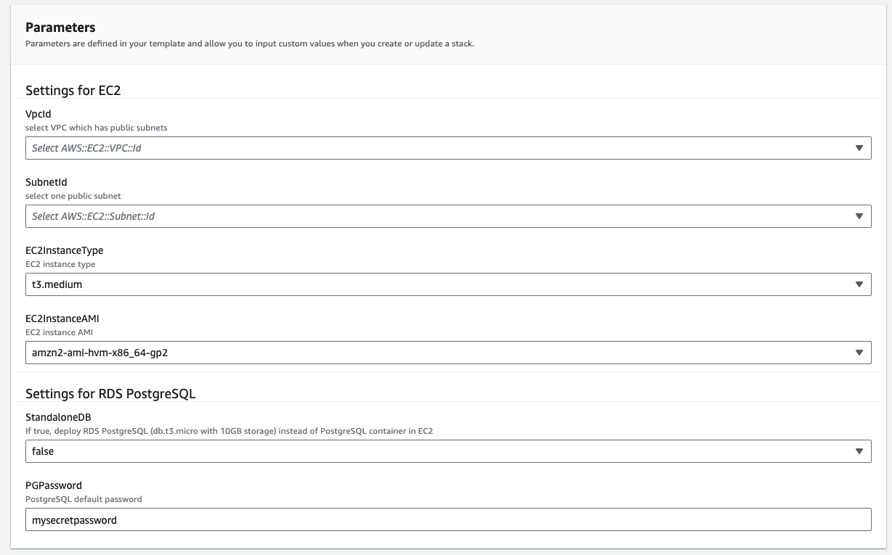

# Quick deploy using Cloudformation

## Supported Region
- Cloudformation template are verified in following regions:
    - us-east-1
    - us-west-2

## Prerequisites
- Enable Claude 3 Sonnet or Haiku in your region - If you are new to using Anthropic models, go to the [Amazon Bedrock console](https://console.aws.amazon.com/bedrock/) and choose **Model access** on the bottom left pane. Request access separately for Claude 3 Sonnet or Haiku.

## Deploy
- In same region, download [quick-build-brconnector.yaml](quick-build-brconnector.yaml) and upload to cloudformation console.
    - Choose a existing VPC with public subnets
    - Choose one public subnet
    - Default use t3.medium as EC2 instance type
    - Default use amazon linux 2023 AMI
    - Default will create PostgreSQL as container in same EC2 (option to false), you could choose to create standalone RDS PostgreSQL as backend (option to true)
    - Default PostgreSQL password is `mysecretpassword`

- Until deploy successfully, go to output page and copy cloudfront URL and first user key to your bedrock client settings page.

- Also you could connect to `BRConnector` EC2 instance with SSM Session Manager ([docs](https://docs.aws.amazon.com/systems-manager/latest/userguide/session-manager-working-with-sessions-start.html#start-ec2-console))

