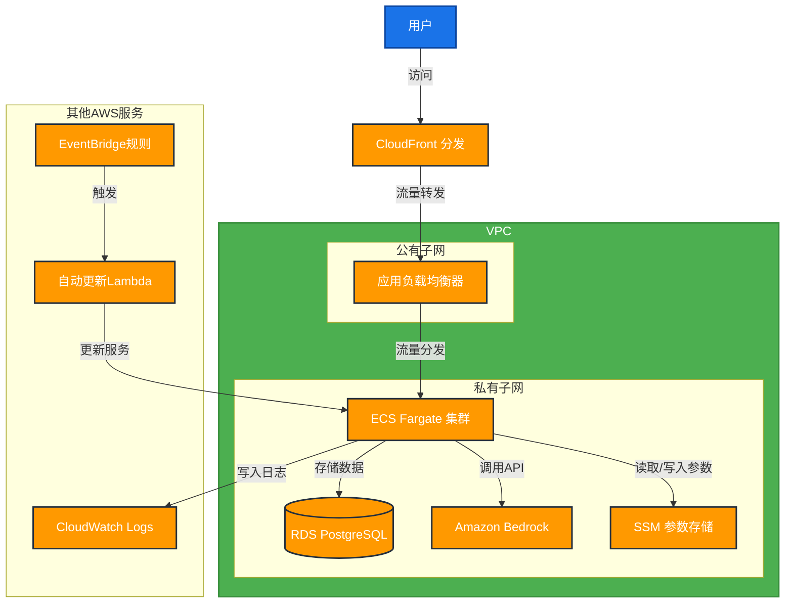

# BRConnector ECS Fargate 架构图

## 架构组件说明

1. **CloudFront**: 提供全球内容分发网络(CDN)服务，加速内容传输并提供HTTPS
2. **应用负载均衡器(ALB)**: 将流量分发到多个可用区的Fargate容器
3. **ECS Fargate**: 托管容器服务，运行BRConnector应用
4. **RDS PostgreSQL**: 托管关系型数据库，存储用户数据和会话
5. **Amazon Bedrock**: AI模型服务，提供基础模型API
6. **SSM参数存储**: 安全存储配置和API密钥
7. **CloudWatch Logs**: 集中化日志存储和监控
8. **Lambda & EventBridge**: 自动化更新组件

## 网络架构

- **公有子网**: 包含ALB，可从互联网访问
- **私有子网**: 包含ECS服务和RDS数据库，无法直接从互联网访问
- **安全组**: 
  - ALB安全组: 允许来自互联网的80/443端口流量
  - ECS安全组: 仅允许来自ALB的8866端口流量
  - RDS安全组: 仅允许来自ECS的5432端口流量
