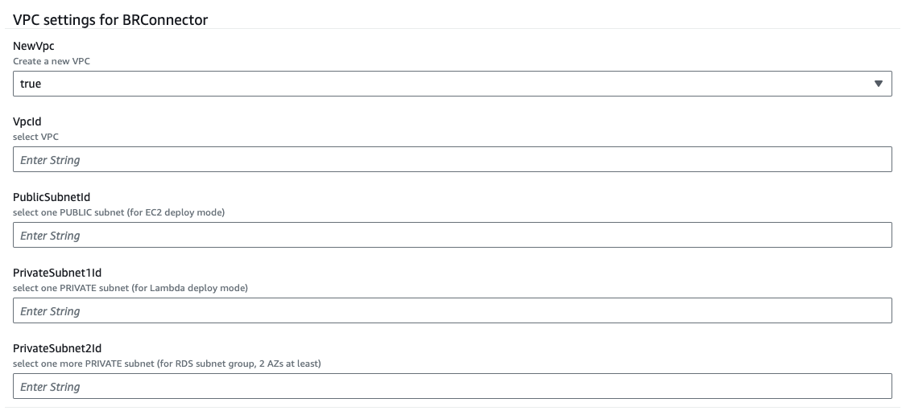
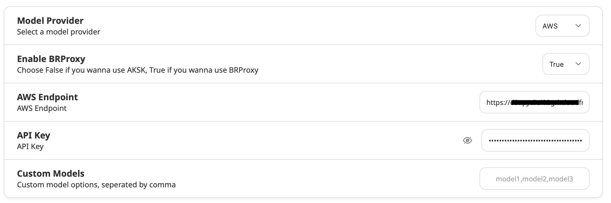

# Quick Deployment

Use CloudFormation for quick deployment.

## Supported Region

Cloudformation template are verified in following regions:

- us-east-1
- us-west-2

## Prerequisites

Enable Claude 3 Sonnet or Haiku in your region - If you are new to using Anthropic models, go to the [Amazon Bedrock console](https://console.aws.amazon.com/bedrock/) and choose **Model access** on the bottom left pane. Request access separately for Claude 3 Sonnet or Haiku.

## Components

Following key components will be included in this Cloudformation template:

- Cloudfront
- BRConnector on Lambda or EC2
- RDS PostgreSQL or PostgreSQL container on EC2
- ECR with pull through cache enabled

## Deploy Guide

- Download [quick-build-brconnector.yaml](https://github.com/aws-samples/sample-connector-for-bedrock/raw/main/cloudformation/quick-build-brconnector.yaml) and upload to Cloudformation console or click this button to launch directly.

[![[attachments/deployment/IMG-deployment.png|200]]](https://console.aws.amazon.com/cloudformation/home#/stacks/create/template?stackName=brconnector1&templateURL=https://sample-connector-bedrock.s3.us-west-2.amazonaws.com/quick-build-brconnector.yaml)

- VPC parameters
  - Choose to create a new VPC or a existing VPC
  - Choose one PUBLIC subnet for EC2 and two PRIVATE subnets for Lambda and RDS (subnet group need 2 AZ at least)



- Compute parameters
  - Choose ComputeType for BRConnector, Lambda or EC2
  - For EC2 settings
    - Now only support Amazon Linux 2023
    - You could choose to create PostgreSQL as container in same EC2 (`StandaloneDB` to false), or create standalone RDS PostgreSQL as backend (`StandaloneDB` to true)
  - For Lambda settings
    - <mark style="background: #ADCCFFA6;">PUBLIC Function URL</mark> will be used. Please ensure this security setting is acceptable
    - Define your private repository name prefix string
    - Always create RDS PostgreSQL (`StandaloneDB` to true)


- PostgreSQL parameters
  - Default PostgreSQL password is `mysecretpassword`
  - If you choose `StandaloneDB` to false, PostgreSQL will running on EC2 as container. RDS PostgreSQL will be create if this option is true.
  - Keep others as default


- Debugging parameters
  - If you choose Lambda as ComputeType, you could choose to delete EC2 after all resources deploy successfully. This EC2 is used for compiling and building BRConnector container temporarily.
  - Don't delete EC2 if you choose EC2 as ComputeType
  - If you set `true` to AutoUpdateBRConnector, one script will be add to ec2 crontab


- Until deploy successfully, go to output page and copy Cloudfront URL and first user key to your bedrock client settings page.



- Also you could connect to `BRConnector` EC2 instance with SSM Session Manager ([docs](https://docs.aws.amazon.com/systems-manager/latest/userguide/session-manager-working-with-sessions-start.html#start-ec2-console))

## Update BRConnector

### AutoUpdate is true

- Check your ECR settings, if has rules in pull through cache page, you have enabled this feature to update ECR image with upstream repo automatically.
- Go to codebuild page, one project will be triggered to build regularly to update your lambda image automatically
- Images in EC2 will be updated using state manager in SSM automatically.

### AutoUpdate is false

- Check your ECR settings, if has rules in pull through cache page, you have enabled this feature to update ECR image with upstream repo automatically.
- Go to codebuild page, one project could be triggered to update your lambda image manually. Click `Start build` to update lambda image.
- Images in EC2 will NOT be updated using state manager in SSM automatically due to no association created. Reference document in SSM to execute commands in EC2 manually.

### ECR without pull through cache enabled (only for previous cfn version)

- following this script to update image manually if you do not enable ECR pull through cache

```sh
export AWS_DEFAULT_REGION=us-west-2
export ACCOUNT_ID=00000000000000
export PrivateECRRepository=your_private_repo_name

aws ecr get-login-password --region ${AWS_DEFAULT_REGION} | docker login --username AWS --password-stdin ${ACCOUNT_ID}.dkr.ecr.${AWS_DEFAULT_REGION}.amazonaws.com

# pull/tag/push arm64 image for lambda
docker pull --platform=linux/arm64 public.ecr.aws/x6u9o2u4/sample-connector-for-bedrock-lambda
docker tag public.ecr.aws/x6u9o2u4/sample-connector-for-bedrock-lambda ${ACCOUNT_ID}.dkr.ecr.${AWS_DEFAULT_REGION}.amazonaws.com/${PrivateECRRepository}:arm64
docker push ${ACCOUNT_ID}.dkr.ecr.${AWS_DEFAULT_REGION}.amazonaws.com/${PrivateECRRepository}:arm64

# pull/tag/push amd64 image for lambda
docker pull --platform=linux/amd64 public.ecr.aws/x6u9o2u4/sample-connector-for-bedrock-lambda
docker tag public.ecr.aws/x6u9o2u4/sample-connector-for-bedrock-lambda ${ACCOUNT_ID}.dkr.ecr.${AWS_DEFAULT_REGION}.amazonaws.com/${PrivateECRRepository}:amd64
docker push ${ACCOUNT_ID}.dkr.ecr.${AWS_DEFAULT_REGION}.amazonaws.com/${PrivateECRRepository}:amd64

# create/push manifest file
docker manifest create ${ACCOUNT_ID}.dkr.ecr.${AWS_DEFAULT_REGION}.amazonaws.com/${PrivateECRRepository}:latest --amend ${ACCOUNT_ID}.dkr.ecr.${AWS_DEFAULT_REGION}.amazonaws.com/${PrivateECRRepository}:arm64 --amend ${ACCOUNT_ID}.dkr.ecr.${AWS_DEFAULT_REGION}.amazonaws.com/${PrivateECRRepository}:amd64
docker manifest annotate ${ACCOUNT_ID}.dkr.ecr.${AWS_DEFAULT_REGION}.amazonaws.com/${PrivateECRRepository}:latest ${ACCOUNT_ID}.dkr.ecr.${AWS_DEFAULT_REGION}.amazonaws.com/${PrivateECRRepository}:arm64 --os linux --arch arm64
docker manifest annotate ${ACCOUNT_ID}.dkr.ecr.${AWS_DEFAULT_REGION}.amazonaws.com/${PrivateECRRepository}:latest ${ACCOUNT_ID}.dkr.ecr.${AWS_DEFAULT_REGION}.amazonaws.com/${PrivateECRRepository}:amd64 --os linux --arch amd64
docker manifest push ${ACCOUNT_ID}.dkr.ecr.${AWS_DEFAULT_REGION}.amazonaws.com/${PrivateECRRepository}:latest

```

- update lambda image with correct architecture
- or login to ec2 to update local image and restart brconnector container

## Migrating to new RDS PostgreSQL database

### Export from existing PG

- list your database name
```sh
docker exec -it postgres psql -U postgres
\l # list databases
```

- dump db
```sh
docker exec -i postgres pg_dump -U postgres -d brproxy_dbname -a > db.sql

```

### Import to new PG

- import to brconnector_db
```sh
docker exec -i postgres psql -U postgres -d brconnector_db < db.sql

```


