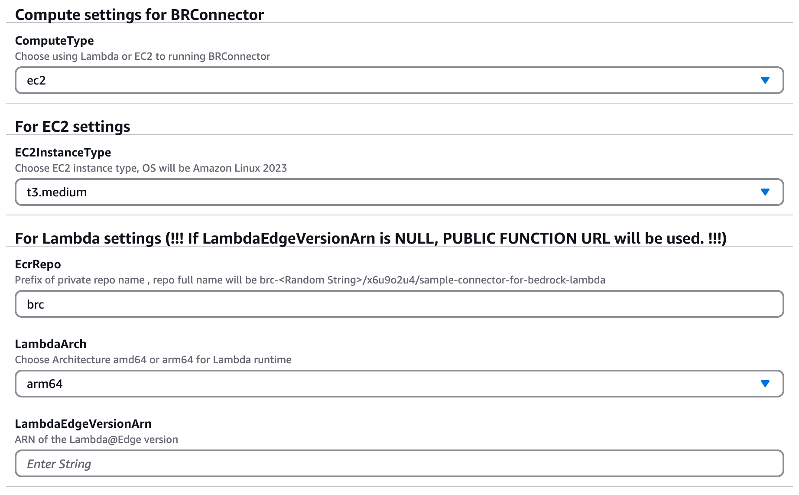
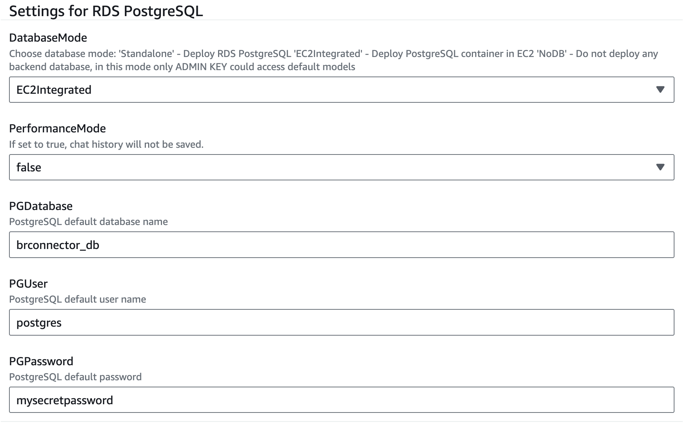
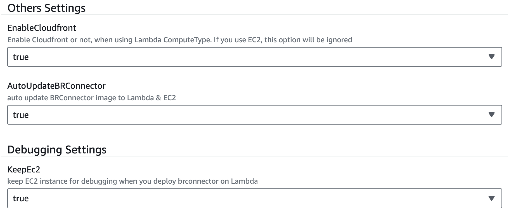
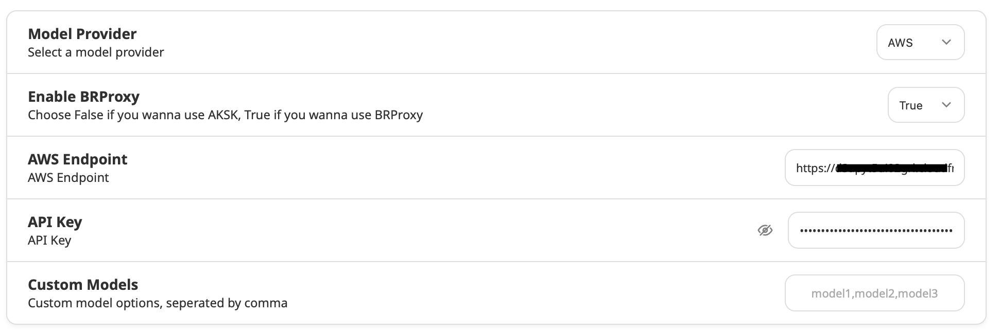

# 快速部署

使用 Cloudformation 快速部署。

## 支持的区域

Cloudformation 模板已在以下区域验证：
- us-east-1
- us-west-2

## 先决条件

在您的区域启用 Claude 3 Sonnet 或 Haiku - 如果您是第一次使用 Anthropic 模型，请转到 [Amazon Bedrock 控制台](https://console.aws.amazon.com/bedrock/) 并在左下角窗格中选择 **模型访问**。单独请求 Claude 3 Sonnet 或 Haiku 的访问权限。

## 组件

此 Cloudformation 模板将包含以下关键组件：
- Cloudfront
- Lambda 或 EC2 上的 BRConnector
- EC2 上的 RDS PostgreSQL 或 PostgreSQL 容器 或者 不需要数据库
- 启用了拉取缓存的 ECR

## 部署模式

以下是一些推荐的部署模式:

- 在 EC2 上部署 BRConnector ，并集成数据库，在 EC2 前面放置 Cloudfront
- 在 Lambda 上部署 BRConnector ，使用独立数据库(或无数据库)，在公开的 Lambda 函数 URL 前面放置 Cloudfront
- 在 Lambda 上部署 BRConnector ，使用独立数据库(或无数据库)，在使用 AWS_IAM 授权类型的 Lambda 函数 URL 前面放置Cloudfront

## 部署指南

- （可选）如果需要使用 AWS_IAM 授权类型的 Lambda 函数 URL ，部署 lambda@edge 在 us-east-1 区域，用于 Cloudfront viewer request。成功部署后，从输出页面获取 Lambda 版本 ARN。

[![[attachments/deployment/IMG-deployment.png|200]]](https://console.aws.amazon.com/cloudformation/home?region=us-east-1#/stacks/create/template?stackName=lambda-edge-use1&templateURL=https://sample-connector-bedrock.s3.us-west-2.amazonaws.com/lambda-edge-use1.yaml)

- 部署 BRConnector 在任何支持的区域。下载 [quick-build-brconnector.yaml](https://github.com/aws-samples/sample-connector-for-bedrock/raw/main/cloudformation/quick-build-brconnector.yaml) 并上传到 Cloudformation 控制台或单击此按钮直接启动。

[![[attachments/deployment/IMG-deployment.png|200]]](https://console.aws.amazon.com/cloudformation/home#/stacks/create/template?stackName=brconnector1&templateURL=https://sample-connector-bedrock.s3.us-west-2.amazonaws.com/quick-build-brconnector.yaml)

- VPC 参数
  - 选择创建新 VPC 或现有 VPC
  - 为 EC2 选择一个公共子网，为 Lambda 和 RDS 选择一个私有子网（ RDS 子网组至少需要 2 个可用区）


- 计算参数
  - 选择 BRConnector、Lambda 或 EC2 的计算类型
  - 对于EC2 设置
    - 现在仅支持 Amazon Linux 2023
    - 您可以选择在同一个 EC2 实例中以容器方式创建 PostgreSQL（DatabaseMode 设置为 `EC2Integrated`），或者创建独立的 RDS PostgreSQL 作为后端数据库（DatabaseMode 设置为 `Standalone`）
  - 对于 Lambda 设置
    - `EcrRepo` 定义您的私有存储库名称前缀字符串
    - `LambdaArch` 定义 Lambda 架构是 arm64 或 amd64 
    - 如果 `LambdaEdgeVersionArn` 为空，将使用 <mark style="background: #ADCCFFA6;">PUBLIC 函数 URL</mark>。请确保此安全设置是可接受的
    - 另外，您可以选择创建 RDS PostgreSQL 数据库（DatabaseMode 设置为 `Standalone`），或者不使用数据库（DatabaseMode 设置为 `NoDB`）



- PostgreSQL 参数
  - DatabaseMode选择：
    - `EC2Integrated` -- 在 EC2 中部署 PostgreSQL 容器
    - `Standalone` -- 部署 RDS PostgreSQL
    - `NoDB` -- 不部署任何后端数据库，在此模式下只有 ADMIN KEY 可以访问默认模型
  - 将 PerformanceMode 设置为 `true`，聊天历史将不会被保存
  - 默认 PostgreSQL 密码为 `mysecretpassword`



- 调试参数
  - 如果选择 Lambda 作为 ComputeType，则可以选择在所有资源部署成功后删除 EC2。此 EC2 暂时用于编译和构建 BRConnector 容器。
  - 如果选择 EC2 作为 ComputeType，请不要删除 EC2
  - 如果将 AutoUpdateBRConnector 设置为 `true`，则会将一个脚本添加到 codebuild 中



- 直到部署成功，转到输出页面并将 Cloudfront URL 和 First User Key 复制到您的 Bedrock 客户端设置页面。



- 您还可以使用 SSM 会话管理器连接到 `BRConnector` EC2 实例 ([docs](https://docs.aws.amazon.com/systems-manager/latest/userguide/session-manager-working-with-sessions-start.html#start-ec2-console))

## 更新 BRConnector

### AutoUpdate 为 true

- 检查您的 ECR 设置，如果在拉取缓存页面中有规则，则您已启用此功能以使用上游存储库自动更新 ECR 映像。
- 转到 codebuild 页面，将触发一个项目定期构建以自动更新您的 lambda 映像
- EC2 中的映像将使用 SSM 中的状态管理器自动更新。

### AutoUpdate 为 false

- 检查您的 ECR 设置，如果在拉取缓存页面中有规则，则您已启用此功能以使用上游存储库自动更新 ECR 映像。
- 转到 codebuild 页面，可以触发一个项目来手动更新您的 lambda 映像。单击“开始构建”以更新 lambda 映像。
- 由于未创建关联，EC2 中的映像将不会使用 SSM 中的状态管理器自动更新。参考 SSM 中的文档以手动在 EC2 中执行命令。

### 未启用拉取缓存的 ECR（仅适用于以前的 cfn 版本）

- 如果您未启用 ECR 拉取缓存，请按照此脚本手动更新映像

```sh
export AWS_DEFAULT_REGION=us-west-2
export ACCOUNT_ID=00000000000000
export PrivateECRRepository=your_private_repo_name

aws ecr get-login-password --region ${AWS_DEFAULT_REGION} | docker login --username AWS --password-stdin ${ACCOUNT_ID}.dkr.ecr.${AWS_DEFAULT_REGION}.amazonaws.com

# pull/tag/push arm64 image for lambda
docker pull --platform=linux/arm64 public.ecr.aws/x6u9o2u4/sample-connector-for-bedrock-lambda
docker tag public.ecr.aws/x6u9o2u4/sample-connector-for-bedrock-lambda ${ACCOUNT_ID}.dkr.ecr.${AWS_DEFAULT_REGION}.amazonaws.com/${PrivateECRRepository}:arm64
docker push ${ACCOUNT_ID}.dkr.ecr.${AWS_DEFAULT_REGION}.amazonaws.com/${PrivateECRRepository}:arm64

# pull/tag/push amd64 image for lambda
docker pull --platform=linux/amd64 public.ecr.aws/x6u9o2u4/sample-connector-for-bedrock-lambda
docker tag public.ecr.aws/x6u9o2u4/sample-connector-for-bedrock-lambda ${ACCOUNT_ID}.dkr.ecr.${AWS_DEFAULT_REGION}.amazonaws.com/${PrivateECRRepository}:amd64
docker push ${ACCOUNT_ID}.dkr.ecr.${AWS_DEFAULT_REGION}.amazonaws.com/${PrivateECRRepository}:amd64

# create/push manifest file
docker manifest create ${ACCOUNT_ID}.dkr.ecr.${AWS_DEFAULT_REGION}.amazonaws.com/${PrivateECRRepository}:latest --amend ${ACCOUNT_ID}.dkr.ecr.${AWS_DEFAULT_REGION}.amazonaws.com/${PrivateECRRepository}:arm64 --amend ${ACCOUNT_ID}.dkr.ecr.${AWS_DEFAULT_REGION}.amazonaws.com/${PrivateECRRepository}:amd64
docker manifest annotate ${ACCOUNT_ID}.dkr.ecr.${AWS_DEFAULT_REGION}.amazonaws.com/${PrivateECRRepository}:latest ${ACCOUNT_ID}.dkr.ecr.${AWS_DEFAULT_REGION}.amazonaws.com/${PrivateECRRepository}:arm64 --os linux --arch arm64
docker manifest annotate ${ACCOUNT_ID}.dkr.ecr.${AWS_DEFAULT_REGION}.amazonaws.com/${PrivateECRRepository}:latest ${ACCOUNT_ID}.dkr.ecr.${AWS_DEFAULT_REGION}.amazonaws.com/${PrivateECRRepository}:amd64 --os linux --arch amd64
docker manifest push ${ACCOUNT_ID}.dkr.ecr.${AWS_DEFAULT_REGION}.amazonaws.com/${PrivateECRRepository}:latest

```

- 使用正确的架构更新 lambda 映像

### 运行在 EC2 上的 BRConnector

- 登录到 ec2 以更新本地映像并重新启动 brconnector 容器

```sh
aws ecr-public get-login-password --region us-east-1 | docker login --username AWS --password-stdin public.ecr.aws
docker pull public.ecr.aws/x6u9o2u4/sample-connector-for-bedrock
docker restart brconnector

```


## 迁移到新的 PostgreSQL 数据库
您可以选择在 ECR 或 RDS 上的容器中直接部署 PostgreSQL，这里列出了一些命令供您在 PG 中迁移数据的参考。

### 将 BRConnector 数据从 EC2 上的 PG 容器迁移到 RDS
- 列出您的数据库名称
```sh
docker exec -it postgres psql -U postgres
postgres=> \l # 列出数据库
postgres=>

```
- dump 整库
```sh
docker exec -i postgres pg_dump -U postgres -d brproxy_dbname > db.sql

```
- 在 RDS 中找到您的 PG 端点 (Endpoint)
- 我们将在您的本地临时运行一个 docker 作为 postgres 客户端，而不是安装 postgresql
```sh
POSTGRES_VERSION=16
docker run --name postgres-client \
-e POSTGRES_PASSWORD=postgres-client-tmp-password \
-d postgres:${POSTGRES_VERSION}

```
- 复制整库导出的文件到新的容器中
```sh
docker cp db.sql postgres-client:/tmp/

```
- 创建目标数据库，然后导入数据
```
docker exec -it postgres-client sh 
# 
# psql -U postgres -h pg-endpoint.xxx.us-west-2.rds.amazonaws.com 
Password for user postgres:
postgres=> CREATE DATABASE brconnector_db;
postgres=> ^D
# psql -U postgres -h pg-endpoint.xxx.us-west-2.rds.amazonaws.com -d brconnector_db </tmp/db.sql
Password for user postgres:
# 
```
- 清理临时 docker on local
```sh
docker rm -f postgres-client

```

## 不支持的区域
中国区域暂时不支持部署，由于：
- Lambda URL 在中国区域不支持
- Cloudfront 在中国区域需要使用已备案的自有域名
- ALB 暴露 443 端口需要使用已备案的自有域名


