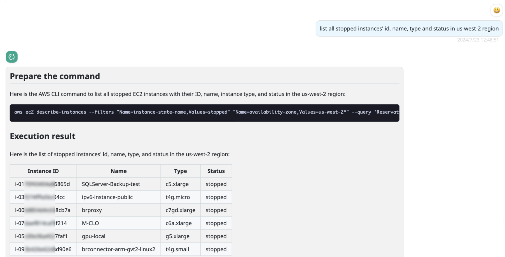
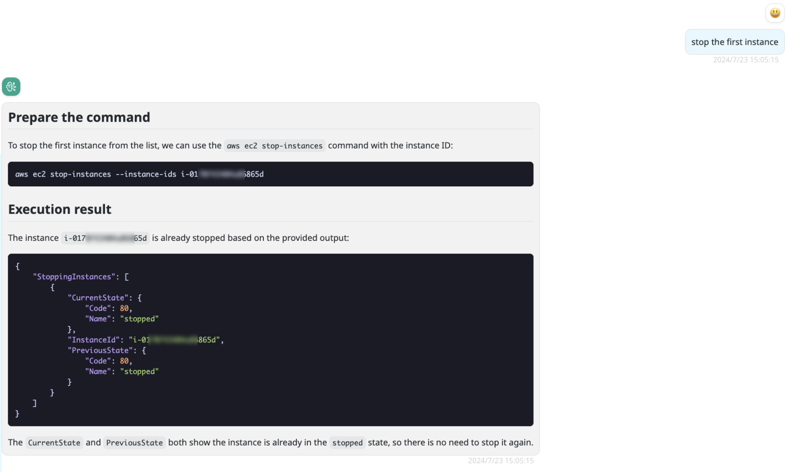

# aws-executor

An AWS command executor.

With this Provider, you can execute AWS command using natural language and get the execution results.

The role for executing AWS commands and the role for running BRConnector are currently the same, so you need to grant the appropriate permissions to the current role.

!!! warning
    Do not grant write permissions to critical resources, as the command lines parsed by the current AI are not stable. However, you can still refer to the command lines suggested by the AI.

## Model configuration

The parameter configuration is as follows:

Name: some-model

Provider: aws-executor

Configuration:

```json
{
  "localLlmModel": "claude-3-sonnet"
}
```

localLlmModel must be configured as a model that supports function calling and already exists in BRConnector.

!!! note
    You need to configure a claude3+ model provided by the bedrock-converse provider, as other models do not yet have the capability for function calling. The early default claude3 model in the system is not driven by converse. If you use these models, you need to update the original configuration to the bedrock-converse provider. Please note to modify the key 'model_id' to 'modelId'.

    And You must install aws cli v2 in the BRConnector host.

## Screenshots in BRClient




