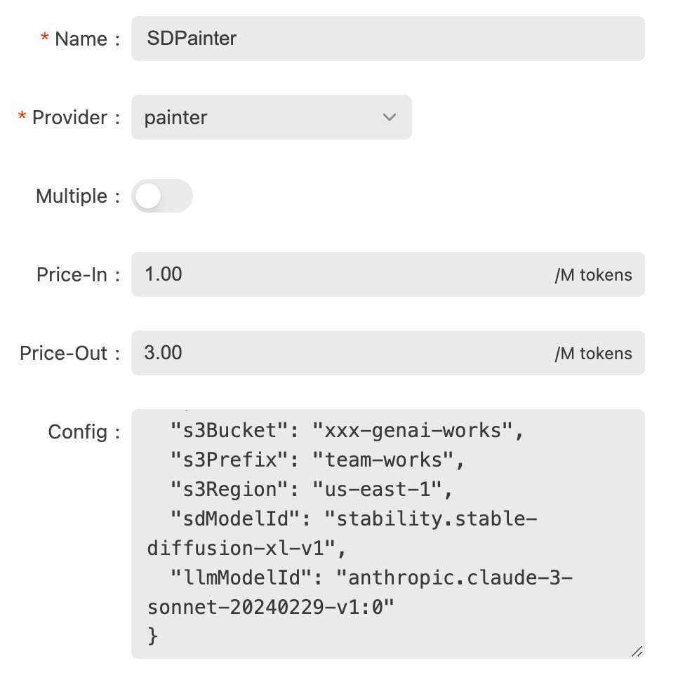
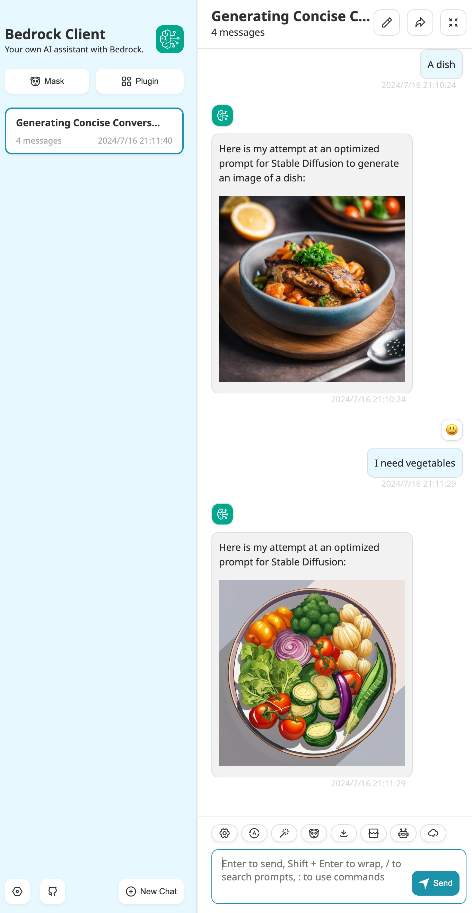
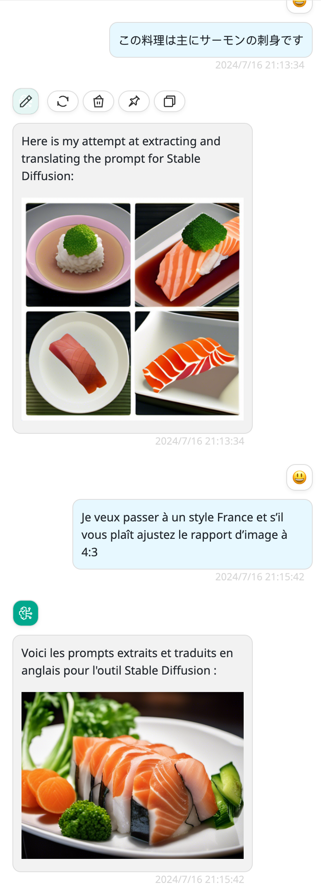

# painter: 使用 Bedrock 画图模型

## 配置

在 /manager UI 中添加模型。



- 名字: 任意
- Provider: painter
- Multiple: 禁用
- Price-in: 任意数字
- Price-out: 任意数字
- 配置：请参见下面的示例。

```json
{
  "regions": [
    "us-east-1", "us-west-2"
  ],
  "s3Bucket": "<your-bucket>",
  "s3Prefix": "<your-prefix>",
  "s3Region": "us-east-1",
  "sdModelId": "stability.stable-diffusion-xl-v1",
  "llmModelId": "anthropic.claude-3-sonnet-20240229-v1:0"
}
```

然后将此模型授予组或 apikey。

## BRClient 中的功能和截图

功能：

- 支持自然语言对话
- 支持多轮对话以细化提示
- 支持多种语言
- 支持图像大小和宽高比

BRClient 中的截图：




