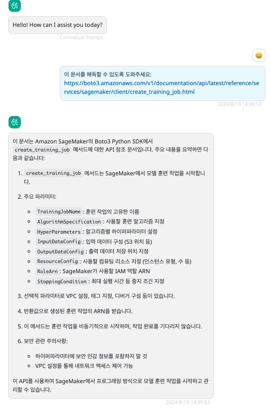

# urls-reader

> Since Docker image version 0.0.12

You can use this provider to read the text content of URLs in conversations, support reading multiple URLs.

## Model configuration

The parameter configuration is as follows:

Name: some-model

Provider: urls-reader

Configuration:

```json
{
  "localLlmModel": "sonnet3.5"
}
```

- localLlmModel: must be configured as a model that supports function calling and already exists in BRConnector.

## Screenshots in BRClient


