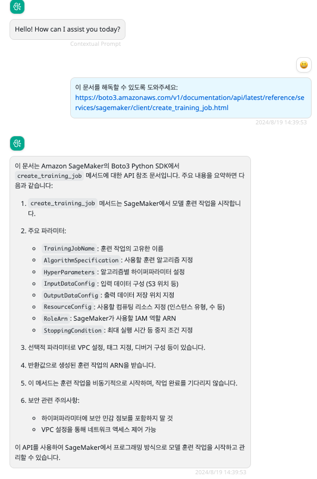

# urls-reader

> Since Docker image version 0.0.12

可以使用本提供器读取对话中的 url 的文字内容，可以支持多个 url 的读取。

## 模型配置

参数配置如下:

Name: some-model

Provider: urls-reader

Configuration:

```json
{
  "localLlmModel": "sonnet3.5"
}
```

- localLlmModel: 必须配置为支持函数调用的模型，并且已存在于 BRConnector 中。

## 在 BRClient 中的截图


