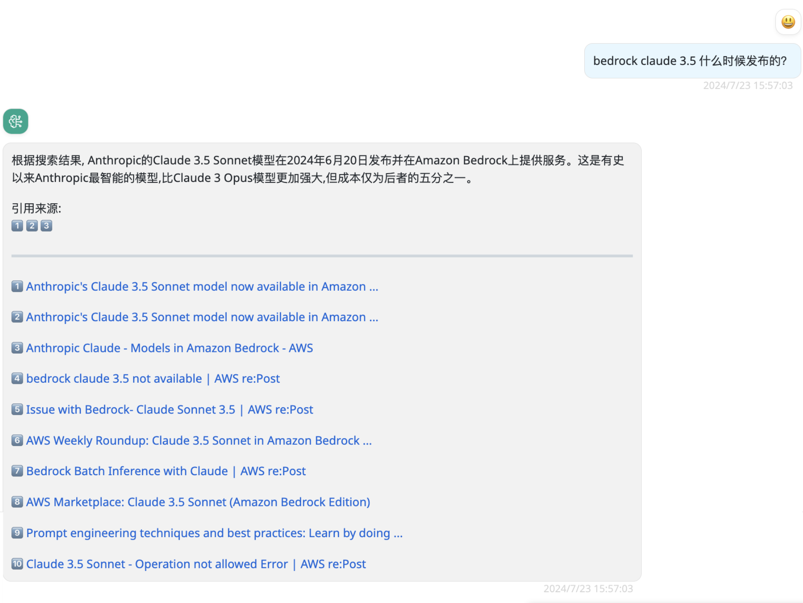

# web-miner

> Since Docker image version 0.0.10

搜索互联网。

本 Provider 可以将您的问题转化为搜索关键词，通过搜索引擎获取结果，然后将其总结成相应的答案。支持多轮对话。

!!! tip
    不要问太多轮次的问题，因为这个 Provider 会把你之前的提示总结成为关键词并进行搜索。

    在 BRClient 中，太长信息会被总结成单一历史记录，从而丢失最早的用户输入，这会导致 AI 回答的结果和您想要的相去甚远。

## 模型配置

参数配置如下:

Name: some-model

Provider: web-miner

Configuration:

```json
{
  "sites": [
    "aws.amazon.com",
    "www.amazonaws.cn",
    "repost.aws",
    "stackoverflow.com"
  ],
  "localLlmModel": "claude-3-sonnet",
  "searxng": {
    "host": "http://127.0.0.1:8081/"
  },
  "serpapi": {
    "apiKey": "xxx......",
    "engine": "google"
  },
  "google": {
    "googleAPIKey": "AIxxxxxx_xxxxxxxx",
    "googleCSECX": "00xxxc000a2xxxxx"
  }
}
```

- sites: 只从这些网站里进行搜索，可以不指定此参数。
- localLlmModel: 必须配置为支持函数调用的模型，并且已存在于 BRConnector 中。
- 支持下面的这些搜索引擎或集合工具中的一个，优先级如下:
  1. searxng
  2. SerpAPI
  3. google

!!! note
    您需要将 localLlmModel 的模型配置成 bedrock-converse 提供程序提供的 claude3+ 模型，其他模型尚不具备函数调用功能。早期系统中默认的 claude3 模型不是由 converse 驱动的。如果您使用这些模型，则需要将原始配置的 Provider 更新为 bedrock-converse。请注意将键 'model_id' 修改为 'modelId'。

## 搜索配置

### searxng

> Since Docker image version 0.0.11

详情请访问 <https://docs.searxng.org/>。

创建一个 settings.yml 文件，增加 json 输出格式。

```yaml
use_default_settings: true
server:
    secret_key: "some-Other-PWD"   # change this!
    bind_address: "0.0.0.0"
search:
  formats:
    - html
    - json
```

启动 searxng:

```shell
docker run --rm -d -p 8081:8080 \
  -v ./settings.yml:/etc/searxng/settings.yml \
  -e "INSTANCE_NAME=searxng" searxng/searxng
```

这样部署出来的 searxng 主机地址是: <http://127.0.0.1:8081/>，请将其配置到 searxng 的 host 节点中。

### SerpAPI

> Since Docker image version 0.0.11

详情请访问 <https://serpapi.com/>。

登录后，您可以在其显眼位置看到 API Key。

engine 参数支持如下这些，默认是 google：

- google
- bing
- baidu
- duckduckgo
- yahoo
- yandex
- yelp
- naver

!!! warning "SerpAPI 不免费"
    请注意：超过每月的限额会被收费。

### Google

使用 Google 自定义搜索引擎，需要如下 2 个 Key，请点击相应链接创建：

- [申请 googleAPIKey](https://console.cloud.google.com/apis/credentials)

- [申请 googleCSECX](https://programmablesearchengine.google.com/controlpanel/create)

!!! warning "Google CSE 不免费"
    请注意：超过每日的限额会被收费。

## 在 BRClient 中的截图




