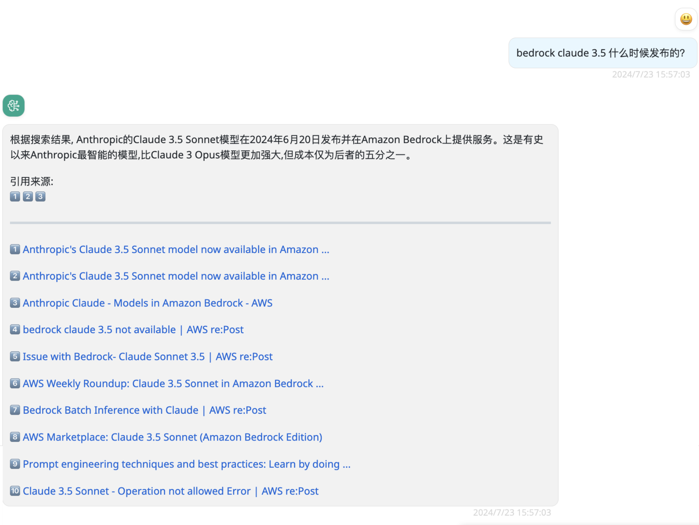
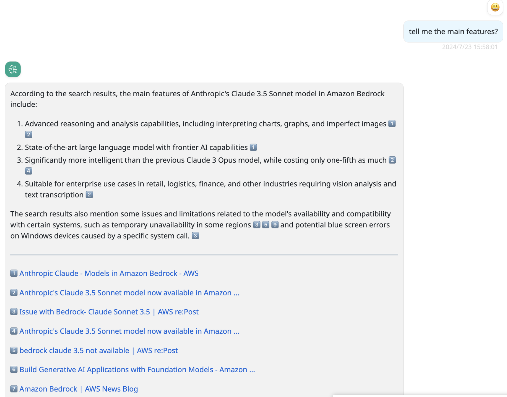

# web-miner：搜索互联网

This Provider can turn your question into search keywords, obtain results through search engines, and then summarize them into corresponding answers.


!!! tip
    Do not ask too many rounds of questions, because this Provider will summarize your previous prompts to keywords for searching.

    And since the results of the questions are too many, the BRClient will summarize the history, thereby losing the earliest user input.

## Model configuration

The parameter configuration is as follows:

Name: some-model

Provider: web-miner

Configuration:

```json
{
  "sites": [
    "aws.amazon.com",
    "www.amazonaws.cn",
    "repost.aws",
    "stackoverflow.com"
  ],
  "localLlmModel": "claude-3-sonnet",
  "searxng": {
    "host": "http://127.0.0.1:8081"
  },
  "google": {
    "googleCSECX": "00xxxc000a2xxxxx",
    "googleAPIKey": "AIxxxxxx_xxxxxxxx"
  },
  "serpapi": {
    
  },
  "duckduckgo": {

  }
}
```

- sites: 只从这些网站里进行搜索。
- 支持下面的这些搜索引擎或集合工具:
    - searxng
    - google
    - DuckDuckGo
    - SerpAPI
- localLlmModel: 必须配置为支持函数调用的模型，并且已存在于 BRConnector 中。


## 搜索配置

### searxng

详情请访问 <https://docs.searxng.org/>。

创建一个 settings.yml 文件，增加 json 输出格式。

```yaml
use_default_settings: true
server:
    secret_key: "some-Other-PWD"   # change this!
    bind_address: "0.0.0.0"
search:
  formats:
    - html
    - json
```


启动 searxng:

```shell
docker run --rm -d -p 8081:8080 \
  -v ./settings.yml:/etc/searxng/settings.yml \
  -e "INSTANCE_NAME=searxng" searxng/searxng
```

这样部署出来的 searxng 主机地址是: http://127.0.0.1:8081/。

### DuckDuckGo

### SerpAPI

!!! warning "SerpAPI 不免费"
    Exceeding the daily free limit will be charged.


### Google

!!! warning "Google CSE 不免费"
    Exceeding the daily free limit will be charged.

[Google CSE key apply](https://developers.google.com/custom-search/v1/introduction)


## Screenshots in BRClient




