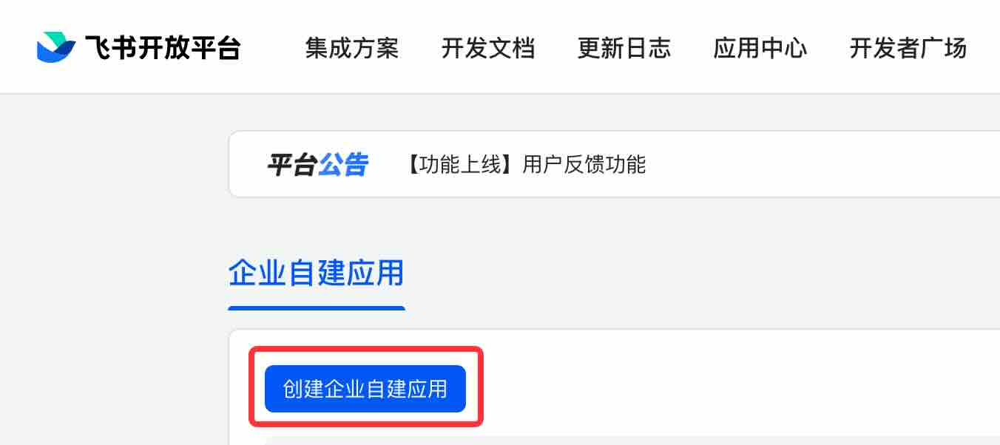
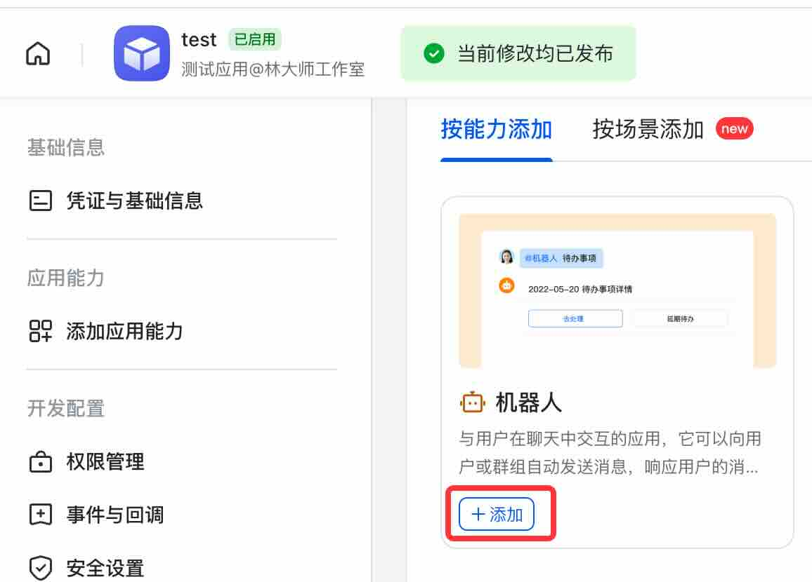
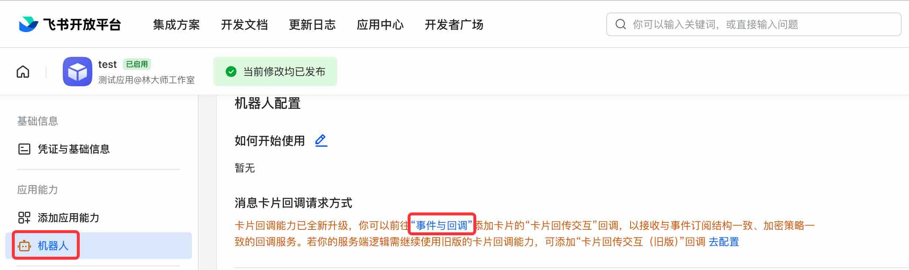
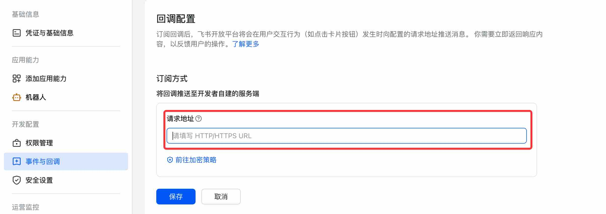
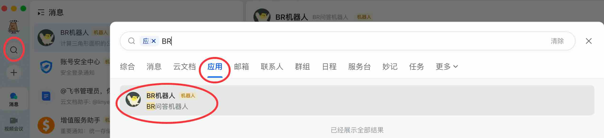

# Feishu (Lark) Bot Configuration

> ⚠️Currently version only supports Feishu, does not support Lark

1. Enterprise administrator logs into the [Feishu Open Platform](https://open.feishu.cn/app/)
2. Create a custom application for the enterprise

3. Fill in the name and description

4. Add the `Bot` capability

5. On the bot configuration page, click on `Events and Callbacks`

6. Edit the `Subscription Method` and modify the request URL. The request URL is related to the server-side webhook name. For specific address details, refer to [Webhook Configuration](management.md#webhook-configuration)

7. Then switch to the corresponding enterprise in Feishu and search for the application (the application name from step 3)

8. Now we can test by sending questions and let the large language model answer them

