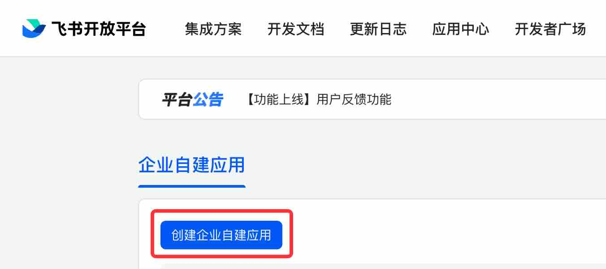
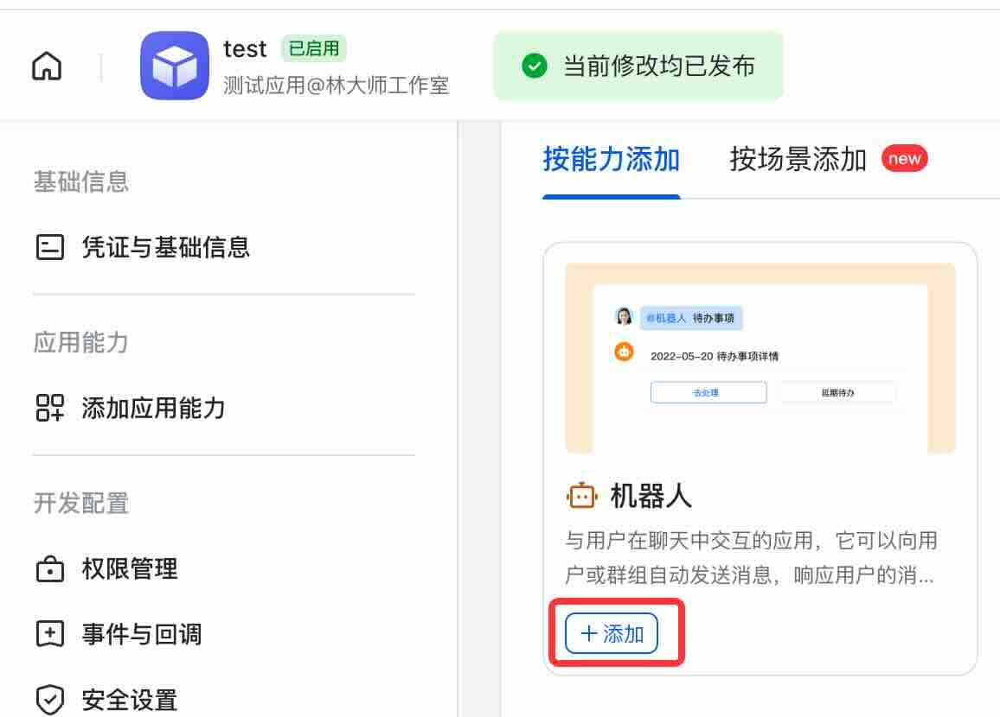
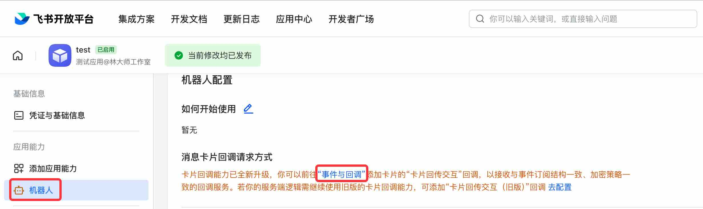

# 飞书机器人

> Since Docker image version 0.0.13

!!! note

    当前版本仅支持飞书，不支持 Lark(飞书国际版)。

1. 企业管理员登录[飞书开放平台](https://open.feishu.cn/app/)

2. 创建企业自建应用

3. 填写名字和描述

4. 添加`机器人`能力

5. 在机器人配置页面中，点击`事件与回调`

6. 编辑`订阅方式`，修改请求地址。请求地址和服务端配置的 webhook 名字有关，形如：`https://<yourdomain>/bot/feishu/<webhook-name>/webhook/event`。具体地址参考[webhoook-配置]。(management.zh.md#webhoook-配置)

7. 添加权限

8. 然后在飞书中切换到对应企业，搜索应用（步骤 3 中的应用名）

9. 然后我们就可以测试发送问题，让大预言模型来回答了

