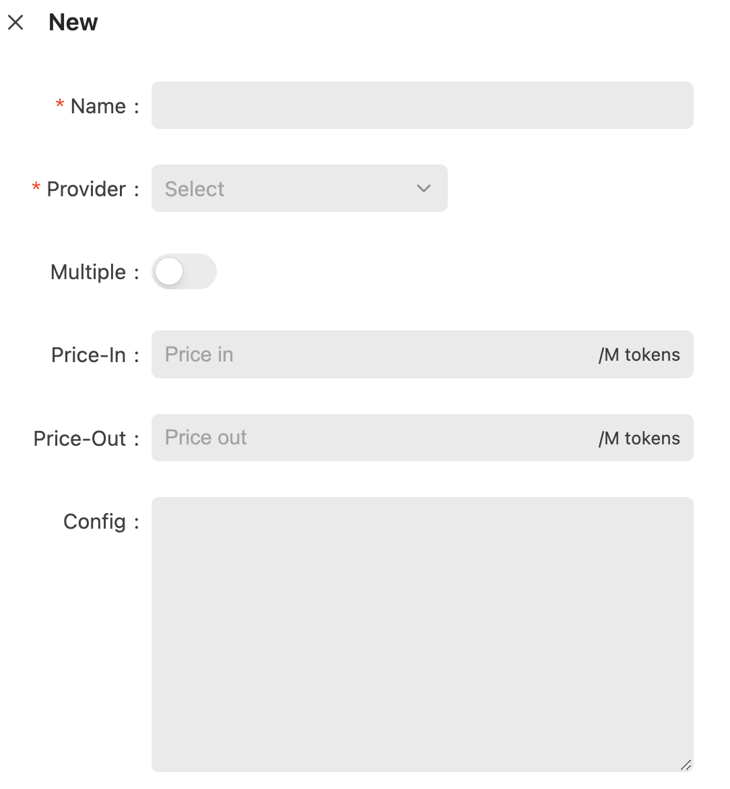
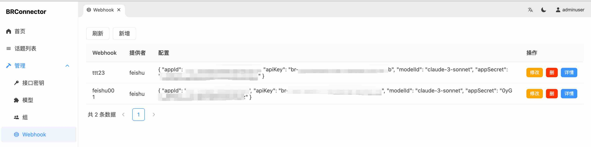
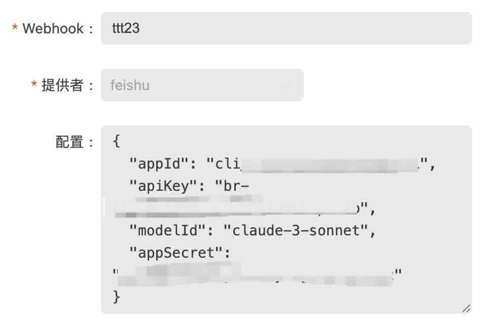

# Management

## Login

The management backend path for BRConnector is: http(s)://your-endpoint/manager/.

Once you have the BRConnector API Key, you can log into the manager backend.

API keys have admin privileges and regular user privileges. Regular users can view their own consumption and chat records.

In addition to having the functions of a regular user, the admin role can also manage API keys, models, and groups.

## API Keys management

### Main features

You can:

- Create a user (issue a Key).
- Import users in bulk.
- Modify this Key, change the name, monthly consumption limit, etc.
- Reset the Key.
- Recharge the Key.

### Import users

You need to prepare a csv file, the column should contain the `name` and `email` fields.

```text
name,email
tom,tom@example.com
jerry,jerry@example.com
```

[Download CSV file](./sample-users.csv).

This project directly supports the import template of cognito. Here's an Excel example of Cognito, where the user's name takes precedence over `cognito:username` and then `name`.

```text
cognito:username,name,given_name,family_name,middle_name,nickname,preferred_username,profile,picture,website,email,email_verified,gender,birthdate,zoneinfo,locale,phone_number,phone_number_verified,address,updated_at,cognito:mfa_enabled
John,,John,Doe,,,,,,,johndoe@example.com,TRUE,,02/01/1985,,,+12345550100,TRUE,123 Any Street,,FALSE
Jane,,Jane,Roe,,,,,,,janeroe@example.com,TRUE,,01/01/1985,,,+12345550199,TRUE,100 Main Street,,FALSE
```

!!!note
    If you have SMTP configured and include the user's email in the csv file, the API key will be emailed directly to the user.

## Models

Enter the manager backend, as shown in the image:

{: style="max-width:600px;"}

Model form:

{: style="max-width:600px"}

A model consists of the following fields:

| Key     | Type      | Required     | Default value | Description |
| ------------- | -------| ------------- | ------------- | ------------- |
| Name  | string   | Y    |  | The name of the model, which is also the model name in the API call |
| Provider  | string   | Y    |  | The Provider is provided by BRConnector for selection. |
| Multiple  | int   | N    | 0 | Whether the current model supports multi-modal. |
| Prince-In  | number   | Y    |  | The price of input tokens. You can define this price arbitrarily, mainly to control the model calling of this system. |
| Prince-Out  | number   | Y    |  | The price of output tokens. |
| Config  | string(json)   | N    |  | Different configurations will be provided according to different providers. |

After creating the model, you need to authorize the model to a group or user (API Key).

!!! tip
    Some clients may restrict users from customizing model names. To enable BRConnector to respond to such requests, you can adopt the following strategies:

    1. Create a new model in the backend with a name matching the one specified by the client, thereby forwarding the request to your actual backend model.
    
    2. Alternatively, you can create a generic model named "default". This way, regardless of the model name passed from the frontend, BRConnector will be able to respond.

    These methods ensure that BRConnector maintains flexibility and compatibility when facing various client requests, thereby enhancing the overall adaptability of the system.

## Group Management

Through groups, you can conveniently grant authorization to models.

At the same time, API Keys can also belong to a group.

## Models Authorization

After creating a model, you need to grant authorization for the model to a group or user (API Key).

On the API Keys list page, click the Models button.

On the Groups list page, there is also a Models button.

The models authorized to API Keys and groups have an "AND" relationship.

## Webhook Configuration

Includes the following features:

- Add Feishu bot
- Modify Feishu bot

To create a Feishu bot, enter the manager backend as shown:
{: style="max-width:600px;"}

Webhook form:

{: style="max-width:600px"}

A Webhook consists of the following fields:

| Key     | Type      | Required     | Default value | Description                          |
| ------------- | -------| ------------- | ------------- |--------------------------------------|
| Name  | string   | Y    |  | Name of the Webhook, which also determines the URL of the Webhook |
| Provider  | string   | Y    |  | Provider is selected from options provided by BRConnector        |
| Config  | string(json)   | N    |  | Different configurations are provided based on different providers                    |

### Config Example
```json
{
  "appId": "cli_xxxxx",
  "apiKey": "br-xxxxx",
  "modelId": "claude-3-sonnet", 
  "appSecret": "xxxxx"
}
```

- appId: The app id of the Feishu bot
- apiKey: The api key of the BRConnector user, which the Feishu bot will use to call models with relevant permissions
- modelId: The name of the model in BRConnector
-appSecret: The app secret of the Feishu bot

> ⚠️Note: Currently, BRConnector must be restarted for the added Webhook to take effect
Example of configured Webhook URL:

- https://<yourdomain>/bot/feishu/<webhook name>/webhook/event
- https://www.example.com/bot/feishu/feishu001/webhook/event