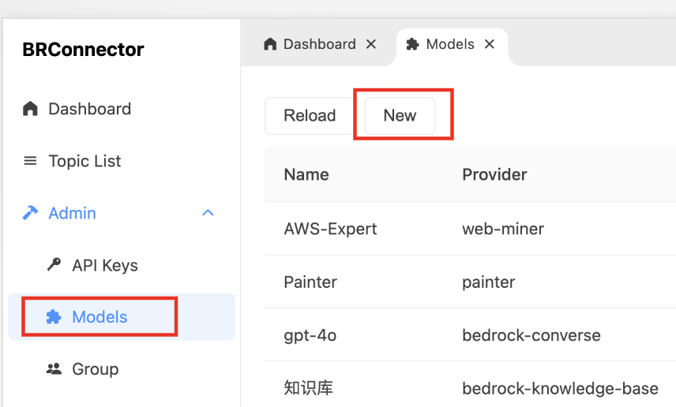
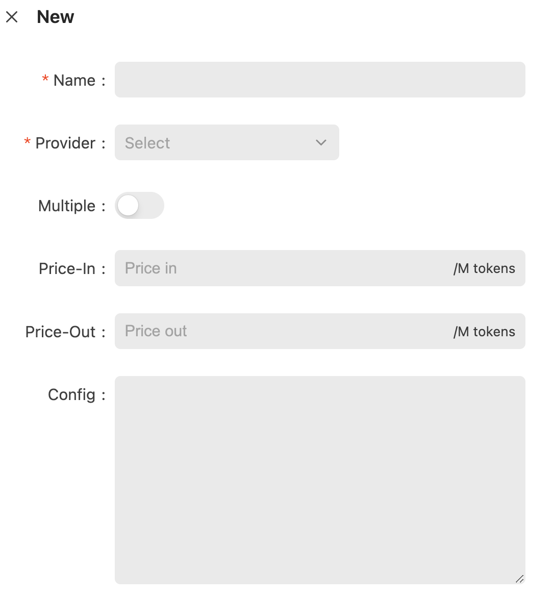

# 后台管理

## 登录

BRConnector 的管理后台路径为：http(s)://your-endpoint/manager/

一旦您有了 BRConnector 的 API Key，就可以登录 manager 管理后台了。

API key 分管理员权限和普通用户权限。普通用户可以看到自己的消费和聊天记录。

管理员角色除了拥有普通用户的功能，还可以管理 API key，模型 和 组。

## API Keys 管理

您可以：

- 创建一个用户（颁发一个 Key）。
- 修改这个 Key，修改名字，月消费额等。
- 重置 Key。
- 给 Key 充值。

## 模型管理

包含如下功能：

- 创建模型
- 修改模型

您第一次部署 BRConnector 的时候，会发现系统仅内置了 bedrock-converse  支持的部分模型。

为了使用新的 Provider，您需要在后台创建一个模型。

创建模型，进入 manager 后台，如图：
{: style="max-width:600px;"}

模型表单：

{: style="max-width:600px"}

模型由以下几个字段组成：

| Key     | Type      | Required     | Default value | Description |
| ------------- | -------| ------------- | ------------- | ------------- |
| Name  | string   | Y    |  | 模型的名字，这个名字也是 API 调用中的模型名字 |
| Provider  | string   | Y    |  | Privder 这个由 BRConnector 提供选择。 |
| Multiple  | int   | N    | 0 | 当前模型是否支持多模态。 |
| Prince-In  | number   | Y    |  | 输入 token 的价格。这个价格您可以随意定义，主要用于控制本系统的模型调用 |
| Prince-Out  | number   | Y    |  | 输出 token 的价格。 |
| Config  | string(json)   | N    |  | 根据不同的提供器会提供不同的配置。 |

## 组管理

通过组，您可以方便地给模型授权。

同时 API Keys 也可以属于某一个组。

## 授权管理

创建完模型，您需要将该模型授权给组或者用户（API Key）。

在 API Keys 的列表页面，点击 Models 按钮。

在 Groups 的列表页面，同样也有 Models 按钮。

API Keys 与 组授权的模型是 “并” 的关系。
