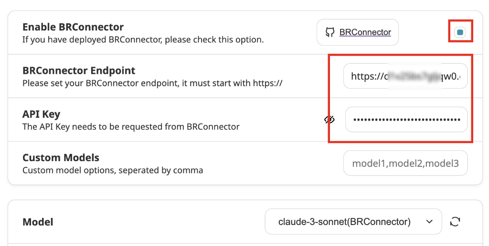

# Sample client for Bedrock

## 简介

Sample client for Bedrock (BRClient) 是一个样例项目，用于展示如何构建一个连接 Bedrock 大语言模型的客户端。

他除了可以在客户端直接发起对 Bedrock 的调用，还可以设置本项目(BRConnector)成为他的 API 后端。

项目地址: [aws-samples/sample-client-for-amazon-bedrock](https://github.com/aws-samples/sample-client-for-amazon-bedrock/)

## 快速启动

您可以直接通过源代码启动 BRClient，也可以[下载各个平台的安装程序](https://github.com/aws-samples/sample-client-for-amazon-bedrock/releases)。

如果您部署了本项目（BRConnector），可以直接通过这个 URL 启动：http(s)://your-endpoint/brclient/。

## 设置

进入 Web 界面后，您需要在设置中启用 BRConnector。

其中 BRConnector Endpoint 填写您的 BRConnector 的路径的根即可。

API Key 填写 BRConnector 颁发的 Key。

设置好之后，您可以刷新页面，从 BRConnector 中获取模型列表。以后每次设置好新的模型后，都可以通过刷新页面获取新模型的列表。
