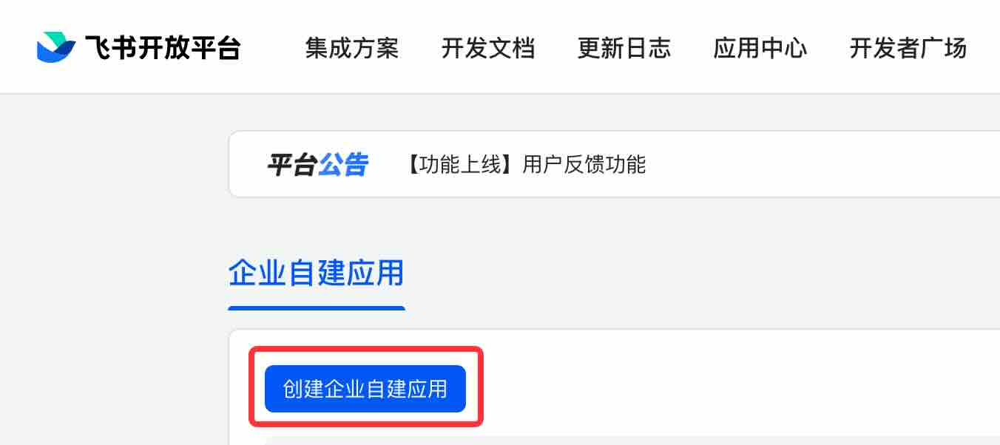
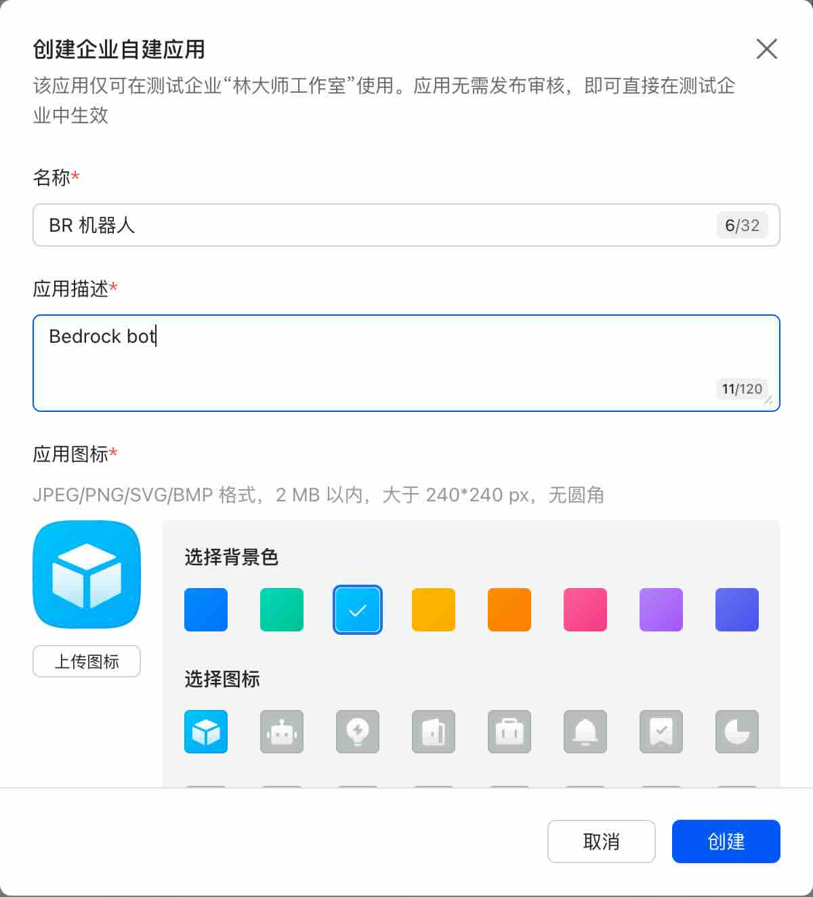
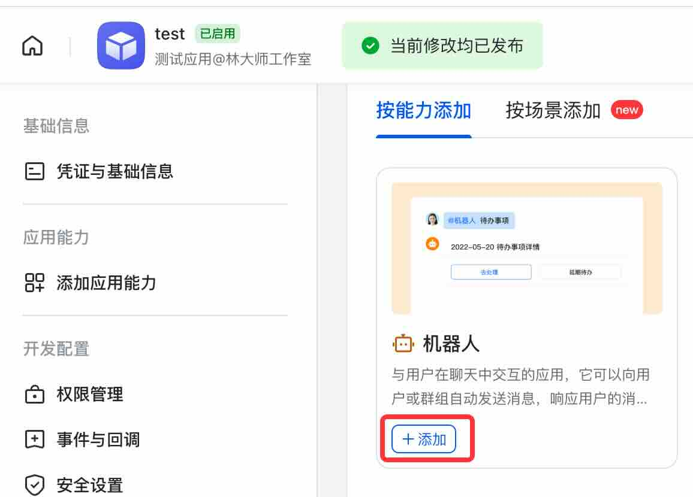
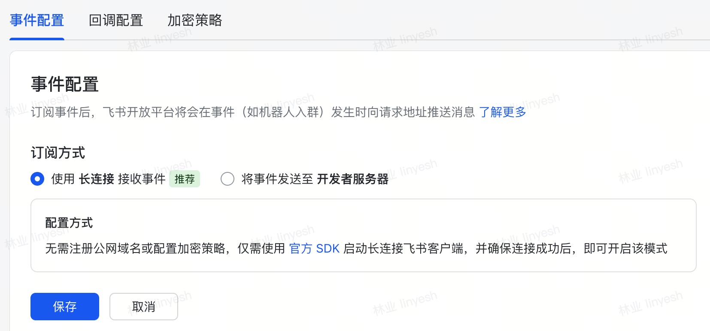
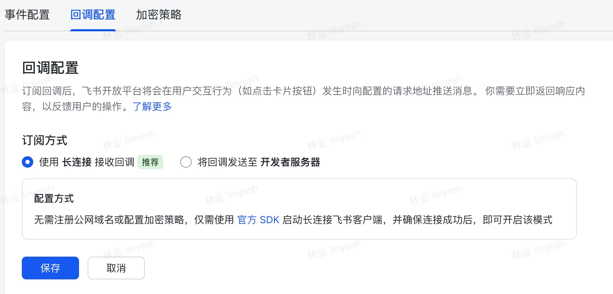
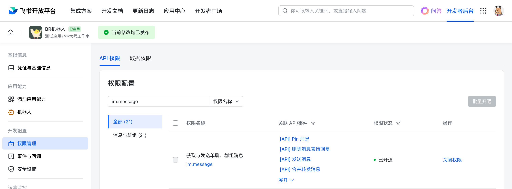
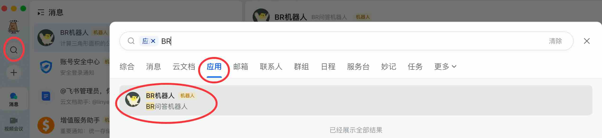
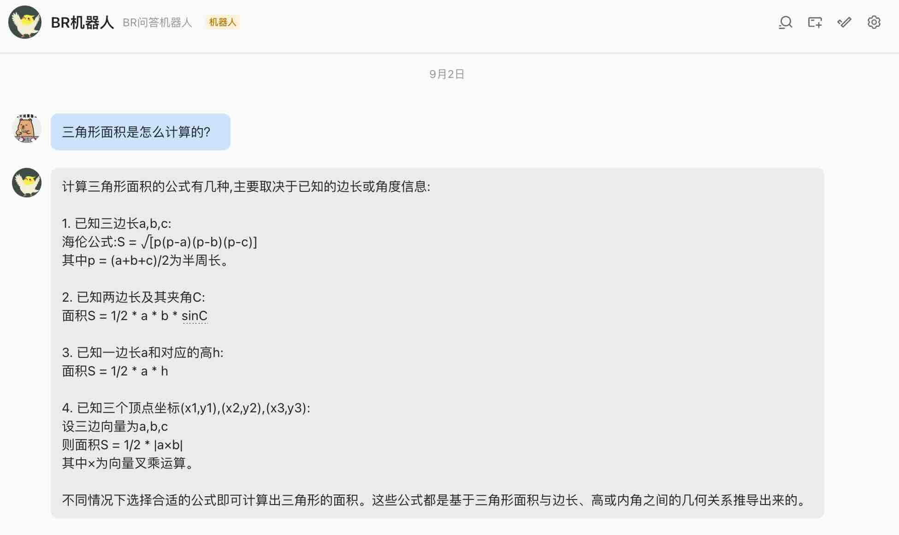

# Feishu Bot

> Since Docker image version 0.0.13

!!! note

    Currently version only supports Feishu, does not support Lark(Feishu international version).

1. Enterprise administrator logs into the [Feishu Open Platform](https://open.feishu.cn/app/)

2. Create a custom application for the enterprise

3. Fill in the name and description

4. Add the `Bot` capability

5. On the bot configuration page, click on `Events and Callbacks`

6. Add permissions

7. Then switch to the corresponding enterprise in Feishu and search for the application (the application name from step 3)

8. Now we can test by sending questions and let the large language model answer them

