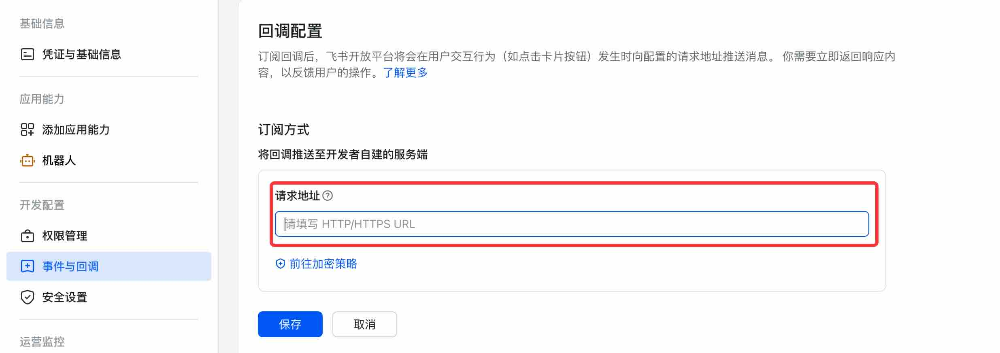

# Feishu Bot

> Since Docker image version 0.0.13

!!! note

    Currently version only supports Feishu, does not support Lark(Feishu international version).

1. Enterprise administrator logs into the [Feishu Open Platform](https://open.feishu.cn/app/)

2. Create a custom application for the enterprise

3. Fill in the name and description

4. Add the `Bot` capability

5. On the bot configuration page, click on `Events and Callbacks`

6. Edit the `Subscription Method` and modify the request URL. The request URL is related to the server-side webhook name, such as `https://<yourdomain>/bot/feishu/<webhook-name>/webhook/event`. For specific address details, refer to [Webhook Configuration](management.md#webhook-configuration)

7. Add permissions

8. Then switch to the corresponding enterprise in Feishu and search for the application (the application name from step 3)

9. Now we can test by sending questions and let the large language model answer them

