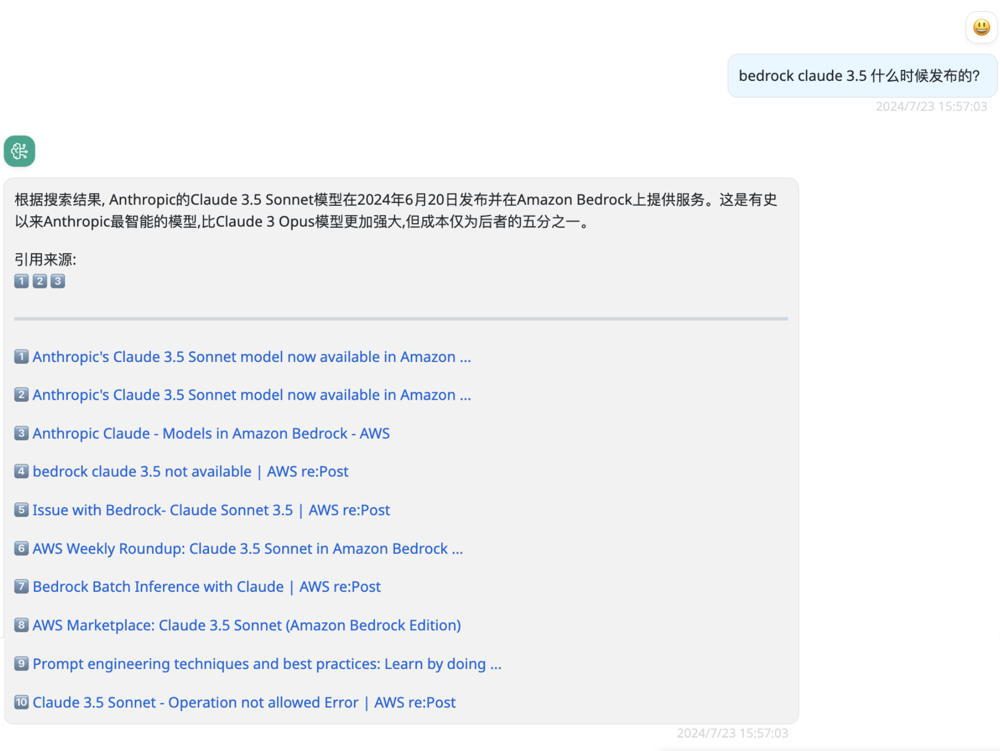
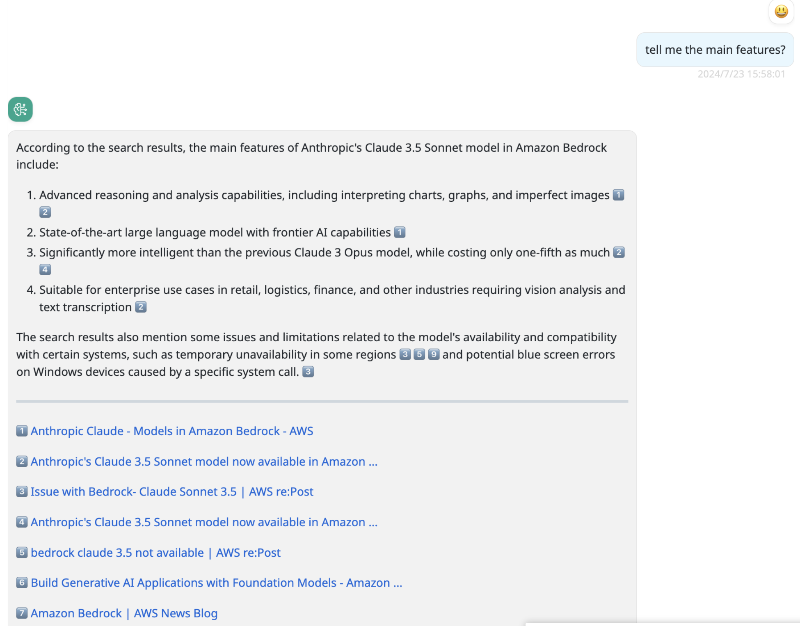

# Web miner with search engine

## Model configuration

The parameter configuration is as follows:

Name: some-model

Provider: web-miner

Configuration:

```json
{
  "sites": [
    "aws.amazon.com",
    "www.amazonaws.cn",
    "repost.aws",
    "stackoverflow.com"
  ],
  "googleCSECX": "00xxxc000a2xxxxx",
  "googleAPIKey": "AIxxxxxx_xxxxxxxx",
  "localLlmModel": "claude-3-sonnet"
}
```

- sites: Limit the search to these websites.
- googleAPIKey: Google API Key
- googleCSECX: Google custom search engine key
- localLlmModel: must be configured as a model that supports function calling and already exists in BRConnector.

[Google CSE key apply](https://developers.google.com/custom-search/v1/introduction)

## Screenshots in BRClient




